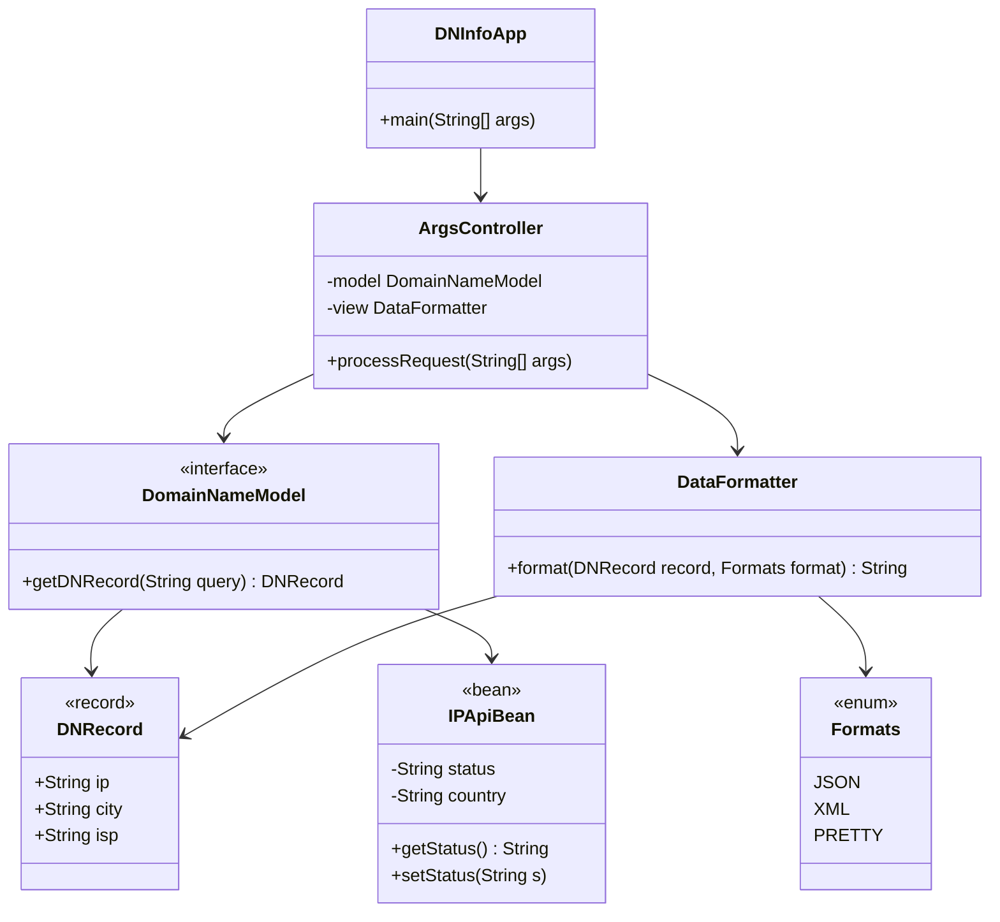
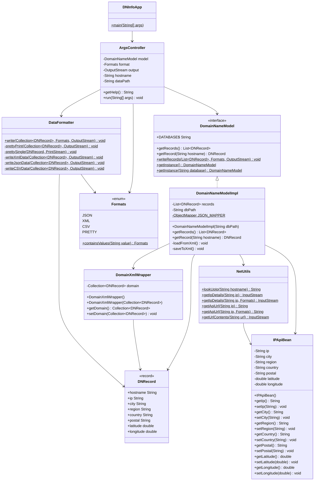

#Design Document

This document is meant to provide a tool for you to demonstrate the design process. You need to work on this before you code, and after have a finished product. That way you can compare the changes, and changes in design are normal as you work through a project. It is contrary to popular belief, but we are not perfect our first attempt. We need to iterate on our designs to make them better. This document is a tool to help you do that.

If you are using mermaid markup to generate your class diagrams, you may edit this document in the sections below to insert your markup to generate each diagram. Otherwise, you may simply include the images for each diagram requested below in your zipped submission (be sure to name each diagram image clearly in this case!)

## (INITIAL DESIGN): Class Diagram

Include a UML class diagram of your initial design for this assignment. If you are using the mermaid markdown, you may include the code for it here. For a reminder on the mermaid syntax, you may go [here](https://mermaid.js.org/syntax/classDiagram.html)

 

## (INITIAL DESIGN): Tests to Write - Brainstorm

Write a test (in english) that you can picture for the class diagram you have created. This is the brainstorming stage in the TDD process. 

> [!TIP]
> As a reminder, this is the TDD process we are following:
> 1. Figure out a number of tests by brainstorming (this step)
> 2. Write **one** test
> 3. Write **just enough** code to make that test pass
> 4. Refactor/update  as you go along
> 5. Repeat steps 2-4 until you have all the tests passing/fully built program

You should feel free to number your brainstorm. 
1. Test 1. When the model is initialized with an existing XML file, records are correctly loaded into memory.
2. Test 2. The DNRecord fields can't be modified after creation.
3. Test 3. edge cases.
4. Test 4. DomainNameModelImpl loads hostrecords.xml correctly and getRecords() returns a list of 3 records with expected hostnames.
5. Test 5. getRecord("www.github.com") returns the correct DNRecord from the existing XML file without making any network call.
6. Test 6. Test that ArgsController with -h prints the help string and does not attempt to run the model.
7. Test 7. Test that ArgsController with no format flag defaults to Formats.PRETTY.

## (FINAL DESIGN): Class Diagram

Go through your completed code, and update your class diagram to reflect the final design. We want both the diagram for your initial and final design, so you may include another image or include the finalized mermaid markup below. It is normal that the two diagrams don't match! Rarely (though possible) is your initial design perfect. 

> [!WARNING]
> If you resubmit your assignment for manual grading, this is a section that often needs updating. You should double check with every resubmit to make sure it is up to date.

## (FINAL DESIGN): Reflection/Retrospective

> [!IMPORTANT]
> The value of reflective writing has been highly researched and documented within computer science, from learning new information to showing higher salaries in the workplace. For this next part, we encourage you to take time, and truly focus on your retrospective.

Take time to reflect on how your design has changed. Write in *prose* (i.e. do not bullet point your answers - it matters in how our brain processes the information). Make sure to include what were some major changes, and why you made them. What did you learn from this process? What would you do differently next time? What was the most challenging part of this process? For most students, it will be a paragraph or two. 

My initial design was largely on the right track structurally, but several concrete details changed once I worked through the actual implementation. The most significant shift was in ArgsController: my initial design treated it as a class with a separate parseArgs() method and a run() method with no arguments, but in the final design these were merged into a single run(String[] args) method. This made more sense because parsing and executing are tightly coupled — there is no meaningful state to hold between them, and keeping them together made the class simpler and easier to test by calling DNInfoApp.main() directly.
Another meaningful change was the addition of dataPath as a field in ArgsController, which I had not anticipated initially. I only realized it was needed once I saw the --data flag in the command line specification and understood that the model could not be constructed until all arguments were parsed. This taught me the importance of reading the full spec before designing, rather than assuming I understood the requirements from a quick scan.
The DomainXmlWrapper class also evolved. The provided version only had a constructor and a private field, but I discovered during implementation that Jackson also needs a no-arg constructor, a getter, and a setter to deserialize XML back into a list of records. This was a good reminder that Jackson's behavior is not always obvious — you have to think about both directions of serialization, not just writing out.
Overall, the TDD process helped me catch these gaps earlier than I would have otherwise. Writing a test for loadFromXml() before fully implementing it forced me to think about what the method actually needed to return, which is when I realized the wrapper needed those additional methods. If I were to do this again, I would spend more time on the initial design reviewing every method signature against the full set of use cases, and I would prototype the Jackson XML round-trip earlier since it turned out to be the trickiest part of the assignment.
